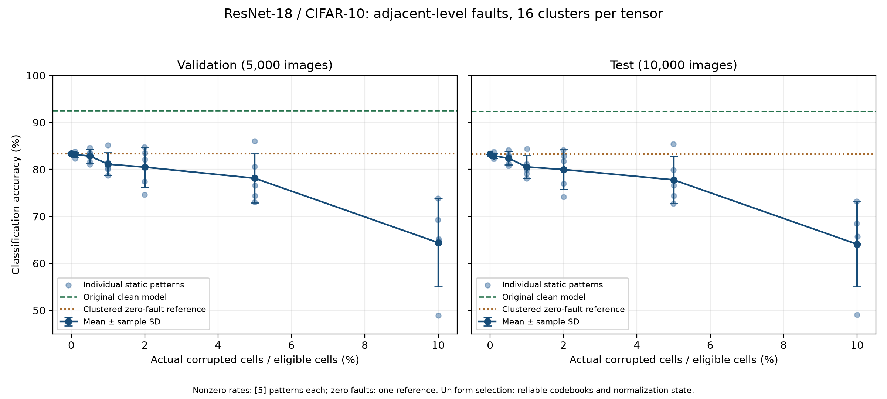

# Fault-Tolerant Neural Networks with Low-Rank Adaptation

This research project asks whether small trainable LoRA adapters can recover
performance lost when hardware memory faults corrupt a neural network's stored
weights. Dense memory can reduce parameter-storage area, but increasing the
number of distinguishable physical levels per cell can make reads less reliable.
The intended experiments will examine the tradeoff between storage efficiency,
model performance, and adapter overhead.

## Implementation status

Steps 1–7 are complete. Clean and k=16 clustered ResNet-18 baselines have been
evaluated on CIFAR-10, and their configurations, splits, preprocessing,
checkpoints/encodings, provenance, and measured results are saved locally. The
original clean checkpoint is preserved. A simplified adjacent-level simulator
has saved one static 1%-probability fault pattern and its reconstructed faulty
checkpoint. All eight full-model Step 6 audit checks and 37 unit tests pass.
Step 7 completed 31 static-pattern evaluations across seven probabilities, with
five patterns per nonzero rate, and saved individual measurements and plots.
LoRA recovery and the language-model extension have not been implemented.

## Step 7 milestone: baseline for LoRA recovery



The left panel shows validation accuracy on 5,000 images; the right shows test
accuracy on 10,000 images. Light-blue points are individual static fault patterns;
dark-blue points and bars show the mean ± one sample standard deviation across
five patterns per nonzero rate. The green dashed line is the original clean
reference, and the orange dotted line is the clustered zero-fault reference.
The x-axis uses the actual fraction of eligible cells corrupted.

Clean test accuracy was **92.28%**. Clustering alone reduced it to **83.29%**;
at 10% fault probability, mean test accuracy was **64.07% ± 9.07 percentage
points** across five patterns. These measurements use the simplified uniform
adjacent-level simulator with 16 clusters per weight tensor. They establish the
damaged-model baseline for the next step: training LoRA adapters and comparing
before/after recovery on the same saved fault patterns. Recovery is not yet
implemented.

[Download the PDF figure](docs/figures/resnet18-cifar10-step7-fault-sweep.pdf)
or read the [full Step 7 results and method](#repeated-fault-rate-experiments-step-7).
The README figure files are repository assets copied from the verified run;
generated experiment outputs remain under the ignored `results/` directory.

## Intended storage representation and faults

The implemented representation groups similar scalar weights into clusters within
each eligible layer. Representative values form a lookup table, or codebook;
each weight position stores an index into that table. For example, a weight of
0.113 might be represented by 0.10 at codebook index 2. A memory read decodes the
stored index and retrieves its representative weight.

The starting reference is [On-Chip Deep Neural Network Storage with Multi-Level
eNVM](https://www.eecs.tufts.edu/~mdonato/assets/papers/dac2018-envm.pdf)
(Donato et al., DAC 2018). Its fault model concerns reads into neighboring
physical levels, with probabilities depending on the cell configuration and
stored level.

An adjacent-level error changes a cell's physical level by one; it is distinct
from an arbitrary binary bit flip. The level-to-information mapping determines
which weight is retrieved. If an index spans multiple cells, a one-level change
in one cell need not change the complete index by one, and it never means adding
or subtracting one from the numerical weight.

A uniform-probability adjacent-level simulator is implemented as an explicit
simplification, not an exact reproduction of the reference paper. A saved,
static fault pattern means keeping the same corruption throughout an experiment;
it does not specify whether the mechanism uses neighboring levels or bit flips.

Two sources of performance loss must be measured separately:

- **Clustering (compression) loss:** replacing the original weights with
  representatives can change predictions even when every read is correct.
  Compare the original model with the clustered, fault-free model.
- **Fault loss:** incorrect reads cause additional substitutions. Compare the
  clustered, fault-free model with the same representation under faults.

## LoRA recovery hypothesis

For a linear layer, the intended adapter calculation is:

```text
h = W_faulty x + (alpha / r) B(Ax)
```

The faulty base weights remain frozen while the low-rank matrices A and B are
trained; r is the adapter rank and alpha / r is its scaling. Recovery is a
hypothesis to test. A low-rank update need not cancel arbitrary corruption, and
useful recovery is not guaranteed. ResNet will require convolution-compatible
adapters where appropriate. Initial recovery comparisons would use saved fault
patterns, with generalization to unseen patterns evaluated separately.

## Proposed model workflow

The first vision workflow will use ResNet-18. If an ImageNet-pretrained model is
evaluated on CIFAR-10, its classifier must be adapted and the model trained or
fine-tuned on the designated training split before establishing a clean baseline.
The checkpoint, preprocessing, data splits, and evaluation settings will be
saved. Classification accuracy will be the main vision metric.

The first research deliverable will plot injected fault count or a precisely
defined fault rate against model performance, include the no-fault baseline, and
repeat independent fault patterns to measure variability. Each run will start
from the appropriate uncorrupted baseline rather than accumulating damage.
Later comparisons will include original, clustered, faulty, and LoRA-adapted
models, with controls for recovery from clustering and from faults.

After validating the vision workflow, a possible extension is Qwen3-0.6B-Base.
It will reuse the memory/fault component with suitable text preprocessing and a
tokenizer. Initial language-model metrics will be held-out loss and perplexity;
perplexity will not be labeled as accuracy.

The structure leaves room for integration with Arya's shared fault-injection
framework and coordination with Meera's TinyBERT benchmarking. No shared
simulator is assumed to exist locally. Future model evaluation code should use a
separate memory/fault component so it can be replaced without rewriting the
evaluation workflow.

## Directory purposes

Model, data, evaluation, and baseline-training code are implemented for Step 3.
The memory package implements Step 4 clustering and fault-free representation
and Step 5 reusable static adjacent-level fault simulation.

| Path | Purpose |
| --- | --- |
| `src/fault_lora/` | Root Python package for the research workflow. |
| `src/fault_lora/models/` | ResNet-18 loading and clean checkpoint restoration; future adapter integration. |
| `src/fault_lora/data/` | Dataset preparation, preprocessing, and split handling. |
| `src/fault_lora/memory/` | Scalar clustering, codebooks, typed indices, reversible physical mappings, and static adjacent-level patterns; future shared component integration. |
| `src/fault_lora/evaluation/` | Metrics and controlled model comparisons. |
| `src/fault_lora/training/` | Clean CIFAR-10 fine-tuning; future adapter-training workflows. |
| `configs/` | Baseline, fault-generation, and fault-audit configurations. |
| `scripts/` | Environment checks, baseline commands, static fault generation, and the full-model audit. |
| `tests/` | Offline baseline, representation, and integrity checks. |
| `results/` | Generated measurements and plots; ignored by Git. |
| `checkpoints/` | Pretrained weights, clean checkpoints, clustered encodings, and decoded checkpoints; ignored by Git. |
| `data/` | Downloaded CIFAR-10 files; ignored by Git. |
| `.venv/` | Local Python virtual environment; ignored by Git. |
| `requirements.txt` | Exact versions of the five direct dependencies. |
| `requirements-macos-arm64.lock.txt` | Platform-specific versions and wheel hashes for all resolved dependencies. |

The root-anchored `/data/` ignore rule excludes downloaded datasets while
preserving the source package `src/fault_lora/data/`. Generated-output directories
are not tracked.

## Clean ResNet-18 baseline (Step 3)

The selected workflow is CIFAR-10 with torchvision's
[ImageNet-pretrained ResNet-18](https://docs.pytorch.org/vision/stable/models/generated/torchvision.models.resnet18.html)
(`IMAGENET1K_V1`). Its final classifier is replaced with a ten-class linear
layer, and all model parameters are fine-tuned. The original convolutional stem
and max-pooling are preserved. This is a target-dataset baseline, not a direct
evaluation of an ImageNet classifier on CIFAR-10.

The initial configuration uses seed 42 and five epochs of SGD with momentum
0.9 and weight decay 0.0005. Backbone and classifier learning rates start at
0.001 and 0.01, respectively, with cosine decay. Training batch size is 128 and
evaluation batch size is 256. This bounded initial recipe is not claimed to be
an optimized CIFAR-10 result.

The completed run selected epoch 5 using validation performance and measured:

| Split | Examples | Correct | Accuracy | Mean cross-entropy |
| --- | ---: | ---: | ---: | ---: |
| Validation | 5,000 | 4,622 | 92.44% | 0.2180 |
| Official test | 10,000 | 9,228 | 92.28% | 0.2299 |

These are actual local measurements from the saved checkpoint, not published
ResNet reference numbers. The initial download/training/evaluation run took
421.4 seconds on MPS. Results describe one seeded run with the documented
96×96 preprocessing; they do not establish variability across training seeds.

The official 50,000-image training set is split into 45,000 training images and
5,000 validation images, reserving 500 per class. The explicit indices are saved.
The official 10,000-image test set is separate and is evaluated once, after all
epochs and validation-only selection of the checkpoint. Selection uses highest
validation accuracy, then lowest validation cross-entropy loss; exact ties
retain the earlier epoch. No test measurements affect checkpoint selection.

Training uses random 32-pixel crops with four pixels of padding and horizontal
flips. Images are then resized directly to 96×96 and normalized with ImageNet
mean/std. Evaluation uses the same resize and normalization with no random
augmentation. **This resolution and direct resizing differ from the pretrained
weights' default 256-resize/224-center-crop preprocessing.** They are saved as an
explicit choice for the local baseline and must remain fixed in later controlled
comparisons. Accuracy is reported as a fraction; cross-entropy is averaged over
examples, including incomplete final batches.

Run from the project root in a process with MPS and network access:

```sh
.venv/bin/python scripts/run_clean_baseline.py --config configs/resnet18_cifar10.json --download
```

`--download` permits downloading CIFAR-10 when missing. The pretrained ResNet-18
weights are cached under `checkpoints/torch-cache/`. Existing dataset files are
integrity-checked by torchvision. Change the configuration's `device` to `cpu`
to run without GPU access; an unavailable explicitly selected device fails.
Change `run_id` for a new run. The command refuses to overwrite existing run
directories. A failed or interrupted run has a status record and may retain
completed-epoch checkpoints; it is not presented as a completed baseline.
`last.pt` stores model weights, not an optimizer-resume state; reproduction
starts a fresh run with the saved configuration.

Artifacts for this run are saved under:

- `checkpoints/resnet18-cifar10-clean-seed42/best.pt`: validation-selected clean
  model, architecture, class order, preprocessing, provenance, and metadata.
- `checkpoints/resnet18-cifar10-clean-seed42/last.pt`: final completed epoch's
  weights and metadata.
- `results/resnet18-cifar10-clean-seed42/`: configuration, split indices,
  preprocessing, environment, manifest, epoch history, status, and final metrics.

The manifest records dataset integrity information, pretrained-weight and split
hashes, and checkpoint selection policy. Final metrics include the selected
checkpoint's SHA-256 hash. Checkpoints can be restored with
`fault_lora.models.resnet.load_clean_checkpoint` without another model download.
Random generators and data-loader workers are seeded; identical bits across
different devices or library versions are not guaranteed. Generated data,
checkpoints, and results remain ignored by Git.

The completed initial run also has `source_sha256.json`, recording hashes of the
source, configuration, and dependency files used for that run. The selected
checkpoint hash is
`7a9d200cbce14c01ddadb68c3a94ce8a9a7990a4cfcdfb7d9f5ae4bdfac47439`.
Seven offline correctness checks passed.

Offline checks require no model or dataset downloads:

```sh
.venv/bin/python -m unittest discover -s tests -v
```

## Clustered-weight baseline (Step 4)

The first configuration uses **16 clusters per eligible weight tensor** with
seed 42. Eligible tensors are all 21 ResNet-18 Conv2d/Linear weights, including
the stem, residual projection convolutions, and classifier: 11,172,032 scalar
weights in total. Biases, batch-normalization parameters, running statistics,
and counters are retained exactly from the clean model. The source is the saved
Step 3 validation-selected checkpoint; no additional training occurs.

The completed paired evaluation measured:

| Split | Clean accuracy | Clustered, zero-fault accuracy | Accuracy drop |
| --- | ---: | ---: | ---: |
| Validation (5,000 images) | 92.44% | 83.34% | 9.10 percentage points |
| Official test (10,000 images) | 92.28% | 83.29% | 8.99 percentage points |

The clustered test model made 8,329 correct predictions, with mean cross-entropy
0.5055 versus the clean model's 0.2299. The clean replay reproduced Step 3's
counts and losses exactly. This is measured clustering/compression loss with
zero faults, not fault loss. Sixteen representatives across all selected tensors
caused a substantial accuracy reduction in this experiment. This single-seed
result does not establish that other counts or layer selections behave the same
way. The clustering and paired evaluation run took 87.4 seconds.

`memory/clustering.py` fits scalar
[scikit-learn KMeans](https://scikit-learn.org/stable/modules/generated/sklearn.cluster.KMeans.html)
independently per tensor using every weight, Lloyd's algorithm, k-means++
initialization, three initializations, a 100-iteration limit, and tolerance
0.0001. Tensor ordinal is added to the run seed to obtain a recorded per-tensor
seed. Four CPU threads are used. Local k-means solutions are not claimed to be
globally optimal. Each codebook is sorted and its assignment labels are remapped
to preserve the decoded weights. A tensor with fewer distinct values than the
requested cluster count uses those exact distinct values and records its actual
codebook size.

The initial physical representation assumes one memory cell per index, with
identity index-to-level mapping into levels 0–15 for each 16-entry codebook.
Both mapping directions are saved, and decoding supports a different saved
permutation. A level change would select a different representative; the
representative's numerical difference need not be one. This is an initial
experimental assumption, not a hardware-calibrated encoding or an exact
reproduction of the reference paper. Codebooks and mapping metadata are assumed
reliable. Step 4 performs **no fault injection**.

Run with existing local CIFAR-10 data and access to MPS:

```sh
.venv/bin/python scripts/run_clustered_baseline.py --config configs/resnet18_cifar10_clustered.json
```

The runner verifies the clean checkpoint hash and saved split hash before
clustering. It saves an encoding containing codebooks, uint8 indices, physical
mappings, and all untouched state, then reloads that artifact and reconstructs
the model. Index decoding and physical-level decoding must agree. The source
model state and source checkpoint file are checked for preservation.

Clean and reconstructed clustered models are evaluated on the same saved
validation and official test splits with the exact Step 3 preprocessing and
evaluation batch size. The clean model is measured again in the same run so
that the reported accuracy difference uses matched conditions. The original
Step 3 clean measurements are also recorded, along with any difference in
correct prediction count. Cluster count is fixed in advance; the run does not
select a configuration using these evaluation results.

Artifacts are stored under
`checkpoints/resnet18-cifar10-clustered-k16-seed42/` and
`results/resnet18-cifar10-clustered-k16-seed42/`:

| Artifact | Purpose |
| --- | --- |
| `encoding.pt` | Self-contained codebooks, indices, physical mappings, untouched state, and metadata. |
| `clustered_dense.pt` | Dense reconstructed weights for ordinary ResNet inference; stored separately from the encoding. |
| `layers.json` | Per-tensor codebooks, mappings, occupancy, seeds, solver iterations, and weight errors. |
| `metrics.json` | Paired clean/clustered measurements, signed accuracy drop in percentage points, and cross-entropy increase. |
| `storage.json` | Actual tensor sizes, serialized file sizes, and separately labeled bit-packing estimates. |
| `manifest.json` | Tensor scope, assumptions, source provenance, algorithm, and evaluation settings. |
| Other JSON records | Configuration, source hashes, copied splits/preprocessing, environment, and completion status. |

Indices are actually stored as uint8 values, which use eight bits each. Sixteen
indices would need four bits each in an ideal packed layout, but bit packing is
not implemented. Storage estimates include codebooks, both mapping tensors,
and all untouched model state. Serialized file sizes also include archive and
metadata overhead. Ordinary inference uses reconstructed dense weights; the
encoded artifact does not establish smaller runtime memory, faster inference,
or hardware area/energy savings.

The measured original dense state contains 44,765,128 tensor bytes. The saved
representation contains 11,255,752 tensor bytes including codebooks, mappings,
and untouched state, a 3.98× tensor-size ratio. The actual serialized encoding
file is 11,312,844 bytes. The estimated packed representation would contain
5,669,736 bytes, but that layout has not been implemented.

Seventeen offline checks passed, including the original seven baseline checks.
New checks cover label remapping, deterministic encoding, exact handling of
constant/small tensors, reversible mappings, invalid representations, model
preservation, serialization, storage accounting, and source-integrity rejection.

## Static adjacent-level fault simulation (Step 5)

The initial configuration uses a **0.01 selection probability per eligible
cell**, seed 42, and the saved k=16 encoding from Step 4. The denominator is
11,172,032 scalar index cells across all 21 Conv2d/Linear weight tensors.
Codebooks, mappings, biases, and batch-normalization state remain reliable.
This is a uniform software model with one cell per index; its probabilities
are simplifying assumptions, not measurements or calibration from the paper.

Each cell is selected by a separate Bernoulli draw. The requested probability
does not force an exact count. For a selected interior level, up and down each
have probability 0.5. At the lowest level, the only transition is 0 → 1; at
the highest level, it is 15 → 14. Boundary events therefore always change the
physical state, with no wraparound or clipped no-op. More generally, a tensor
with K=1 has no neighboring state and is excluded from the denominator.

For the current K=16 representation:

| Stored level | Probability of correct read | Probability of reading one level lower | Probability of reading one level higher |
| --- | ---: | ---: | ---: |
| 0 | 0.99 | 0 | 0.01 |
| 1–14 | 0.99 | 0.005 | 0.005 |
| 15 | 0.99 | 0.01 | 0 |

The generated artifact contains these actual counts:

| Quantity | Recorded value |
| --- | ---: |
| Eligible cells | 11,172,032 |
| Expected selected count (N × p) | 111,720.32 |
| Actual corrupted cells | 111,858 |
| Realized fault rate | 1.001232% |
| Upward transitions | 56,326 |
| Downward transitions | 55,532 |
| Transitions from the lowest boundary | 292 |
| Transitions from the highest boundary | 89 |
| Changed decoded scalar weights | 111,858 |

Physical-cell changes and decoded-weight changes are recorded separately. They
match in this run because the selected transitions have distinct representatives;
they need not match if representatives tie. The ±1 transition refers to the
physical level, and the saved level-to-index mapping selects the resulting
codebook value. Its numerical weight difference need not be one. Overall
up/down counts need not be equal, especially with forced boundary directions.

`src/fault_lora/memory/faults.py` exposes `generate_fault_pattern`,
`summarize_fault_pattern`, and `apply_fault_pattern`. These functions take a
saved encoding and do not depend on datasets or training. Optional tensor
selection permits later sensitivity studies. Sampling uses an isolated CPU
`torch.Generator`, sorted tensor names, float64 uniform draws for selection,
and integer direction draws for the selected cells. The seed, algorithm,
tensor order, and PyTorch version are saved. A seed alone does not promise
identical sampling across library versions; the saved transitions are the
authoritative pattern for replay.

The pattern records flattened cell positions and their exact original and
destination levels. A semantic SHA-256 fingerprint binds it to the source
codebooks, indices, both mappings, and untouched state. Application validates
that fingerprint and the sparse transitions, then reconstructs an independent
dense state from the uncorrupted encoding. Replaying the same pattern does
not accumulate faults or modify its inputs. Static faults mean these saved
substitutions stay fixed throughout a later experiment; they are not resampled
on each inference call. The simulator does not currently model level-dependent
hardware error rates, multiple cells per index, or faults in reliable metadata.

Generate from existing local artifacts, using CPU only:

```sh
.venv/bin/python scripts/generate_fault_pattern.py --config configs/resnet18_cifar10_faults.json
```

The command refuses to overwrite existing run directories. Change `run_id`
for another generation, along with the desired probability and seed. It
verifies the recorded Step 4 encoding/dense hashes, exact decoding agreement,
and original clean-checkpoint hash before generating a pattern. It reloads
the saved pattern, creates a faulty checkpoint, restores that checkpoint,
checks exact tensor agreement and a finite `(2, 10)` CPU forward pass on
synthetic inputs, and confirms source artifact hashes are unchanged.

Artifacts are saved under
`checkpoints/resnet18-cifar10-faults-p001-seed42/` and
`results/resnet18-cifar10-faults-p001-seed42/`:

| Artifact | Purpose |
| --- | --- |
| `pattern.pt` | Exact sparse transitions, sampling choices, source fingerprint, seed, and static-model assumptions. |
| `faulty_dense.pt` | Reconstructed faulty ResNet state with preprocessing, classes, split provenance, and pattern/source hashes. |
| `counts.json` | Actual cell and weight changes, realized rate, per-tensor counts, directions, boundaries, and level histograms. |
| `manifest.json` | Source artifact paths/hashes, scope, assumptions, generated hashes/sizes, and artifact-check results. |
| Other JSON records | Configuration, environment, source-code hashes, and completion status. |

The serialized pattern occupies 1,135,910 bytes and the dense faulty checkpoint
44,806,091 bytes. These are software artifact sizes, not hardware overhead
measurements. Generation, persistence, and artifact checks took 0.52 seconds
after source validation. Twenty-four offline unit checks passed, including
seven new simulator checks for zero faults, neighboring transitions and
boundaries, nonidentity mappings, seeded replay, singleton exclusions, changed
weight accounting, malformed patterns, and invalid configuration.

**No dataset accuracy or loss was measured in Step 5.** The synthetic forward
check establishes that the saved model runs; it does not quantify damage.
Step 6 has audited the complete ResNet artifacts; Step 7 will measure fault
loss against the **83.29% clustered zero-fault test baseline**, keeping it
separate from the original clean model's 92.28% accuracy and clustering loss.

## Full-model fault correctness audit (Step 6)

The completed CPU audit checks the actual saved ResNet encoding, static pattern,
and faulty checkpoint across 21 clustered tensors, 11,172,032 eligible cells,
and all 122 model-state tensors. It supplements the small-tensor unit tests
with an independent decoding calculation in
`src/fault_lora/evaluation/fault_checks.py`. That calculation derives original
physical levels directly from stored indices and mappings, checks the sparse
transitions, and constructs expected weights by substituting only the selected
positions. It compares the entire reconstructed state, including all unselected
weights and reliable biases/normalization state, against the simulator output.

All eight audit checks passed:

| Check | Actual result |
| --- | --- |
| Source integrity | Recorded clean, clustered, pattern, and faulty-checkpoint hashes matched; the saved encoding reconstructed its clustered checkpoint exactly. |
| Zero faults | All 122 state tensors matched the clustered baseline; outputs for two seeded synthetic inputs were finite and exactly equal. |
| Saved pattern and checkpoint | All 111,858 transitions were valid neighbors; independent decoded weights and counts matched the saved checkpoint and count records. |
| Repeated application | Two applications to the baseline produced identical state without accumulating damage. |
| Same seed | Seed 42 regenerated every saved position, original level, and destination level exactly. |
| Different seed | Seed 43 produced a different valid pattern with 111,848 selected cells. |
| All-cell selection | p=1 selected all 11,172,032 eligible cells; every transition stayed within bounds and moved by exactly one physical level. |
| Source preservation | The in-memory baseline fingerprint and all input artifact hashes remained unchanged. |

The all-cell check exercised 28,240 lower-boundary transitions and 9,778
upper-boundary transitions, all moving inward. The zero-fault check used a
local input generator with seed 0 and ResNet in evaluation mode. The original
saved 1%-probability pattern and checkpoint were preserved. Temporary zero-fault,
all-cell, and alternate-seed patterns were used only for correctness checks and
were not saved as performance experiments.

Run the audit with existing local artifacts:

```sh
.venv/bin/python scripts/check_fault_injection.py --config configs/resnet18_cifar10_fault_checks.json
```

It refuses to overwrite the audit directory; use a new `run_id` for another
audit. Exact regeneration from the seed requires the recorded PyTorch version;
replaying saved transitions is checked separately. The audit records its own
configuration, environment, source-code hashes, status, and a detailed
`report.json` under `results/resnet18-cifar10-fault-checks-seed42/`. The completed
audit took 1.20 seconds after source loading and validation.

Thirty-one offline unit tests passed. Seven additional tests check that the
independent oracle detects wrong selected weights, changed unselected/reliable
state, invalid neighboring transitions, missing state tensors, and dtype changes;
they also cover nonidentity mappings, restricted tensor scope, pattern comparison,
and audit configuration validation.

These checks establish correctness for the implemented simplified mechanism
and the recorded artifacts. **No dataset performance was measured in Step 6.**
Hardware calibration remains separate. Step 7 evaluated accuracy across
fault probabilities and repeated patterns, always starting from the clustered
zero-fault baseline.

## Repeated fault-rate experiments (Step 7)

The completed MPS sweep measured the following results. Uncertainty is sample
standard deviation across five fault patterns, expressed in percentage points;
the zero-fault row is one deterministic reference.

| Selection probability | Mean corrupted cells | Validation accuracy, mean ± SD | Test accuracy, mean ± SD | Additional test accuracy drop from clustered reference |
| --- | ---: | ---: | ---: | ---: |
| 0% | 0 | 83.34% (reference) | 83.29% (reference) | 0.00 pp |
| 0.1% | 11,199.8 | 83.15% ± 0.54 pp | 82.89% ± 0.53 pp | 0.40 pp |
| 0.5% | 55,954.0 | 82.84% ± 1.47 pp | 82.38% ± 1.40 pp | 0.91 pp |
| 1% | 111,569.0 | 81.12% ± 2.46 pp | 80.53% ± 2.44 pp | 2.76 pp |
| 2% | 223,478.0 | 80.48% ± 4.28 pp | 79.97% ± 4.21 pp | 3.32 pp |
| 5% | 558,662.2 | 78.11% ± 5.26 pp | 77.77% ± 5.01 pp | 5.52 pp |
| 10% | 1,117,265.8 | 64.40% ± 9.40 pp | 64.07% ± 9.07 pp | 19.22 pp |

Mean accuracy decreased across these predeclared rates, while pattern variation
increased. At 10%, test accuracy ranged from 49.09% to 73.16%. Some individual
patterns improved on the clustered reference: the 5% pattern with seed 64
achieved 85.35% test accuracy, while that rate's five-pattern mean was 77.77%.
These observations describe one trained checkpoint and five sampled patterns
per nonzero rate; they do not establish that faults generally improve accuracy
or that the means would remain identical with more patterns.

The clean replay reproduced 92.44% validation and 92.28% test accuracy, and the
clustered replay reproduced 83.34% and 83.29%, with the prior counts and losses.
The 8.99 pp clean-to-clustered test drop remains compression loss; the 19.22 pp
mean additional drop at 10% is fault loss. The run took 191.6 seconds after
source validation, including plotting. All 31 saved patterns, 62 validation/test
records, CSV records, means/sample standard deviations, plot hashes, prior
source hashes, and input artifact hashes were verified. The exported PNG was
visually inspected. These checks are recorded in `verification.json`.

The initial sweep uses selection probabilities of 0%, 0.1%, 0.5%, 1%, 2%, 5%,
and 10%. Each nonzero probability has five independent static patterns. The
zero-fault model is evaluated once because it is a deterministic reference,
giving 31 pattern evaluations in total. Nonzero patterns use unique seeds
42–71, allocated in ascending rate order; the zero pattern uses seed 42 with
no corrupted cells. Rates and seeds are declared before evaluation.

Every pattern is applied to the same uncorrupted k=16 encoding. The complete
reconstructed model state is loaded before evaluation, including all reliable
state, so faults do not accumulate across runs. The exact sparse pattern is
saved and reloaded before use, and stays fixed for both validation and test.
Clean and clustered zero-fault references are replayed in the same run.
Compression loss is recorded separately from the signed additional fault loss
relative to the clustered reference. Negative fault-loss values are retained
if a particular pattern improves accuracy; monotonic degradation is not assumed.

The saved 5,000-image validation split and official 10,000-image test split,
96×96 preprocessing, and evaluation batch size 256 are preserved. Both splits
are evaluated for every pattern, using MPS and no training or augmentation.
Test results characterize the predeclared sweep; they do not select weights,
rates, seeds, or hyperparameters. The completed Step 6 audit and the hashes
of its input artifacts are checked before the sweep starts.

Run with existing local data and MPS access:

```sh
.venv/bin/python scripts/run_fault_sweep.py --config configs/resnet18_cifar10_fault_sweep.json
```

Choose a new `run_id` for another sweep; existing output directories cannot be
overwritten. For CPU execution, explicitly set `device` to `cpu`. An unavailable
explicit device fails. Individual measurements and completion progress are saved
after every pattern; a failed/interrupted run is labeled and retains its finished
records. The current command starts a fresh run and does not resume partial runs.

The run saves artifacts under
`results/resnet18-cifar10-fault-sweep-seed42/` and
`checkpoints/resnet18-cifar10-fault-sweep-seed42/`:

| Artifact | Purpose |
| --- | --- |
| `plan.json` | Predeclared probabilities, unique pattern seeds, and pattern IDs. |
| Checkpoint `patterns/*.pt` | Exact sparse transitions and source fingerprints for every pattern, including zero. |
| Result `patterns/*.json` | Each pattern's actual cell/weight changes, per-layer counts, validation/test metrics, signed fault losses, and pattern hash. |
| `measurements.json` / `measurements.csv` | All individual measurements; one CSV row per pattern and split. |
| `aggregate.json` | Per-rate means, sample standard deviations, minima, maxima, seeds, actual counts/rates, accuracies, losses, and fault losses. |
| `references.json` | Replayed clean/clustered metrics and differences from Steps 3/4. |
| `accuracy_vs_fault_rate.png` / `.pdf` | Exportable two-panel validation/test figure. |
| `verification.json` | Post-run consistency checks for all patterns, measurements, aggregation, CSV records, plots, and source preservation. |
| Other JSON records | Configuration, splits, preprocessing, environment, source-code hashes, provenance, source preservation, and status. |

The plots use **actual corrupted cells divided by eligible cells**, expressed
as a percentage, on the x-axis. They show individual patterns and per-rate
mean accuracy with ±1 sample standard deviation (ddof=1). This describes variation
over fault patterns on a fixed trained model and fixed dataset; it is neither a
confidence interval nor variation over training seeds. The single zero-fault
reference has no estimated standard deviation (`null` in the aggregate). The
original clean and clustered zero-fault accuracies are distinct reference lines.
The accuracy axis is bounded from the observed values and labeled in percent.

Only sparse patterns are duplicated per run. Dense faulty weights can be
reconstructed with `apply_fault_pattern(source_encoding, saved_pattern)` when
needed for recovery. The source encoding, clean checkpoint, original Step 5
pattern, and all previously audited artifacts are preserved. The experiment
continues to use uniform adjacent-level probabilities and one cell per index;
it is not a hardware-calibrated result.

## Planned research roadmap

1. **Repository scaffold and local environment:** completed; establish folders,
   package initializers, ignore rules, documentation, and a local virtual environment.
2. **Dependencies and compute setup:** completed; inspect the local hardware,
   install compatible macOS arm64 wheels, lock dependency versions and hashes,
   and check library imports and tensor execution. See the environment section
   for installed versions and compute details.
3. **Clean ResNet baseline:** completed; fine-tuned ImageNet-pretrained ResNet-18
   on CIFAR-10 and saved the validation-selected checkpoint, evaluation settings,
   splits, provenance, and measured clean performance.
4. **Clustered-weight baseline:** completed; saved k=16 per-tensor codebooks,
   indices, mappings, dense reconstruction, provenance, storage accounting, and
   paired measurements of clustering loss with zero faults.
5. **Fault simulation:** completed; implemented a simplified adjacent-level
   simulator and saved a static p=0.01, seed-42 pattern, faulty dense checkpoint,
   exact transition/count records, assumptions, and source provenance.
6. **Fault-injection correctness checks:** completed; eight full-ResNet audit
   checks passed for zero-fault identity, independent transition decoding,
   boundaries, reproducibility, static replay, and source preservation; the
   full offline unit suite contains 31 passing tests.
7. **Fault-rate experiments:** completed; evaluated seven probabilities with
   five independent patterns at each nonzero rate (31 total), replayed clean
   and clustered references, and saved individual/aggregate measurements,
   exact patterns, source provenance, verification, and PNG/PDF plots.
8. **LoRA recovery:** freeze base parameters and train suitable adapters on the
   training split using saved patterns; evaluate transfer to unseen patterns separately.
9. **Controlled comparisons:** compare original, clustered, faulty, and adapted
   models; vary rank and placement and record parameter, storage, and computation overhead.
10. **Qwen extension:** reuse the validated memory/fault workflow with a language
    model, tokenizer, text dataset, and appropriate language-model metrics.

Training, validation, and test data will remain separate. Future experiments
must document assumptions and save configurations, seeds, fault patterns,
checkpoints, preprocessing, splits, and measurements sufficient for reproduction.
Results will only be reported after experiments are actually performed.

## Python environment and dependencies

The existing project-local `.venv` was inspected and reused. Its Python executable
works and reports **Python 3.11.4**. Step 2 installed the following core packages
and their dependencies into this environment. System Python was not changed.

| Package | Installed version | Planned role |
| --- | --- | --- |
| PyTorch (`torch`) | 2.14.1 | Tensor operations and future model execution. |
| `torchvision` | 0.29.1 | Future ResNet models, vision datasets, and preprocessing. |
| NumPy | 2.4.6 | Array handling and future experiment data. |
| scikit-learn | 1.9.1 | Weight clustering and future analysis. |
| Matplotlib | 3.11.2 | Future plots. |

These versions were selected by resolving compatible binary wheels for the
actual environment and verifying them together. Transformers and PEFT are
deferred until the language-model or adapter steps need them.

From the project root, activate the environment in the detected zsh shell:

```sh
source .venv/bin/activate
```

The same activation command works in bash. Verify or invoke the environment
explicitly, without relying on activation persisting across separate shells:

```sh
.venv/bin/python --version
```

For a fresh checkout without a `.venv`, use an existing Python 3.11 interpreter
to reproduce this dependency environment. Inspect any existing environment
before creating one:

```sh
python3.11 --version
python3.11 -m venv .venv
source .venv/bin/activate
.venv/bin/python --version
```

On a matching macOS arm64 / CPython 3.11 environment, install the full lockfile:

```sh
.venv/bin/python -m pip install --index-url https://pypi.org/simple --only-binary=:all: --require-hashes -r requirements-macos-arm64.lock.txt
.venv/bin/python -m pip check
.venv/bin/python scripts/check_environment.py
```

The lockfile pins all 28 resolved packages, including transitive dependencies
and the setuptools version required by PyTorch, with their exact wheel hashes.
Pip itself is not pinned. The native macOS wheels require macOS 14 or later.
This lockfile is specific to CPython 3.11 on macOS arm64; another platform or
Python minor version needs its own resolution and verification. The shorter
`requirements.txt` records direct versions, but does not lock transitive versions
or wheel hashes. A Linux/CUDA environment has not been configured or tested.

The check prints a JSON report of the Python/platform versions, package
versions, backend availability, selected device, and verification results.
It imports all five libraries, checks the headless Matplotlib Agg backend,
tests the NumPy/PyTorch bridge, performs tiny float32 matrix multiplications on
CPU and the selected device, and exercises a compiled torchvision operator on
CPU. It does not instantiate models, download anything, train, evaluate datasets,
or write plots. Import and tensor failures cause a nonzero exit status.

For an explicit device check:

```sh
.venv/bin/python scripts/check_environment.py --device cpu
.venv/bin/python scripts/check_environment.py --device mps
```

Automatic selection chooses an available CUDA device, then MPS, then CPU. An
explicit unavailable device fails rather than silently switching devices.

### Local compute

The inspected machine is an Apple M3 Pro MacBook Pro running macOS 26.6, with
11 CPU cores, a 14-core Apple GPU, and 18 GB of unified memory. Python runs
natively as arm64. The installed PyTorch build includes MPS and has no available
CUDA backend on this machine.

Library imports, CPU tensor checks, and the compiled torchvision operator check
passed. MPS was unavailable inside the Codex sandbox, but an explicit MPS check
outside the sandbox passed, including GPU matrix multiplication and transfer
back to CPU. Both CPU and MPS execution are verified; run future GPU workflows
in a process that has GPU access.

PyTorch's [MPS backend](https://docs.pytorch.org/docs/2.14/notes/mps.html) provides
GPU tensor execution through Apple's Metal framework. Backend availability must
be checked in the process that will run the experiment; restricted execution
environments may hide GPU access. These installation checks do not establish
model throughput, training capacity, or compatibility of every model operator.

## Experimental assumptions to confirm

- The initial Step 4 representation uses 16 clusters per Conv2d/Linear weight
  tensor, sorted codebooks, and one cell per index with identity level mapping.
  These are documented experimental choices; group agreement and eventual hardware
  calibration remain open. Step 5 implements inward transitions at boundaries.
- Step 5 uses saved static patterns and uniform p=0.01 cell selection with
  equiprobable interior directions. Hardware calibration and a level-dependent
  error model remain open; these initial probabilities are experimental choices.
- Codebooks and adapter parameters may initially use reliable storage. Their
  storage overhead must still be included in later efficiency comparisons.
- CIFAR-10 and the initial baseline configuration are selected and documented
  above. The fault-rate denominator is eligible scalar index cells; sweep rates,
  repetition count, adapter ranks, and placement still require agreement before
  the corresponding fault/recovery experiments.
- Recovery for a fixed pattern and transfer to unseen patterns are separate
  research questions; neither outcome is assumed.

## Reference

Donato, Reagen, Pentecost, Gupta, Brooks, and Wei (2018), DAC '18.

- [DOI: 10.1145/3195970.3196083](https://doi.org/10.1145/3195970.3196083)
- [Author-hosted PDF](https://www.eecs.tufts.edu/~mdonato/assets/papers/dac2018-envm.pdf)
